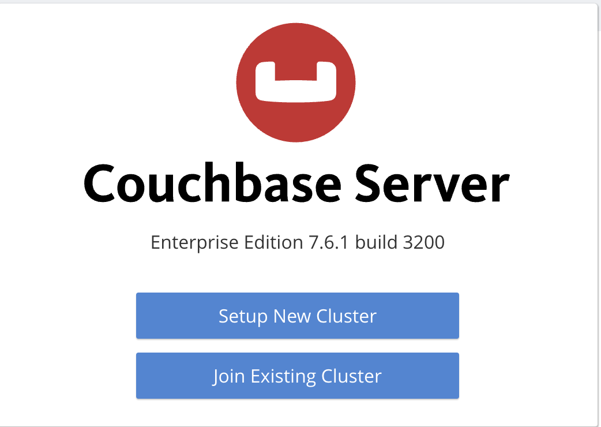
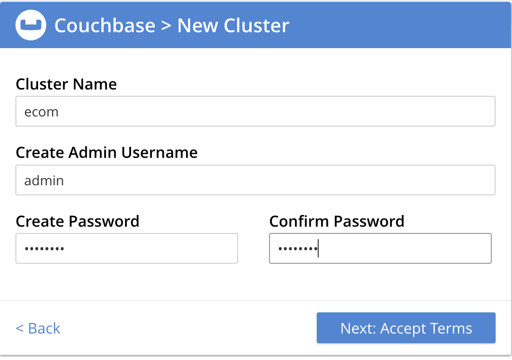
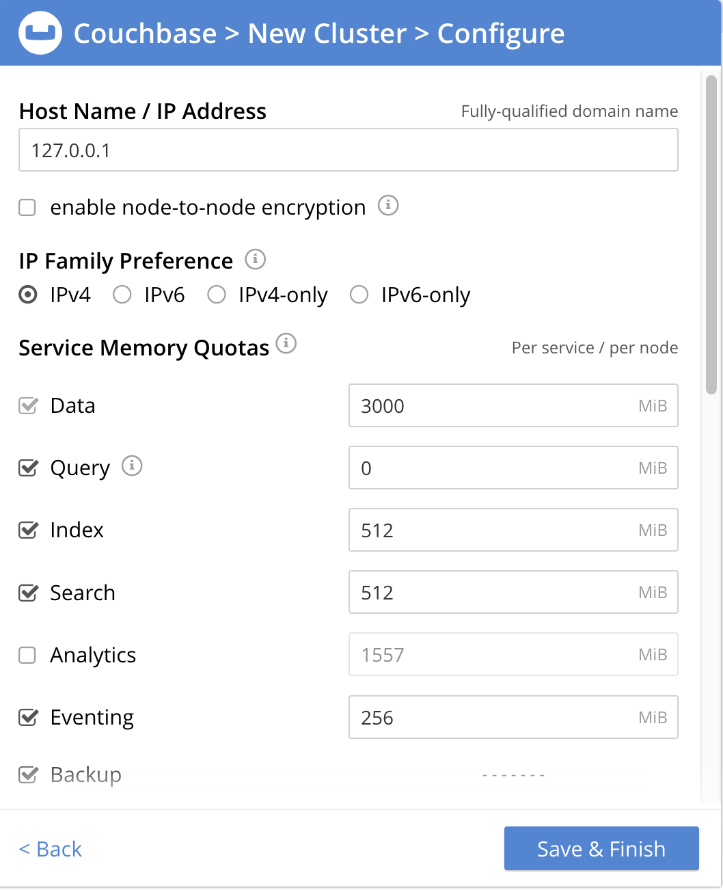
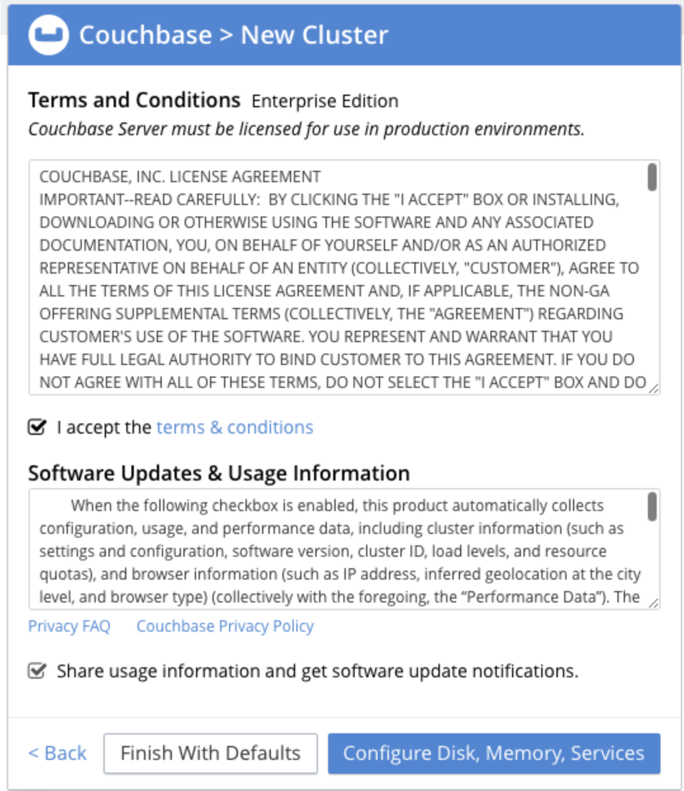
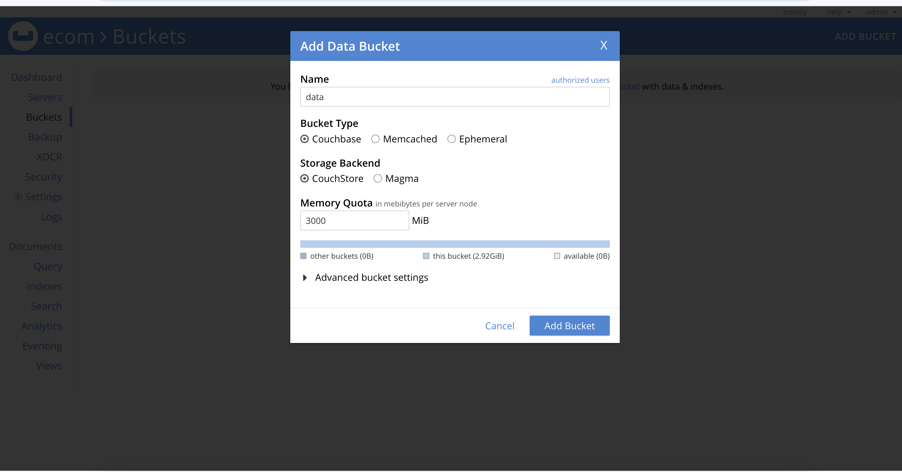

# Couchbase Setup

>user vm or docker

## install

**vm**
```
#!/bin/bash
sudo wget https://packages.couchbase.com/releases/7.6.1/couchbase-server-enterprise-7.6.1-linux.x86_64.rpm
yes | sudo yum install ./couchbase-server*.rpm
sudo systemctl start couchbase-server
```

**docker**
```
docker run -d --name couchbase -p 8091-8096:8091-8096 -p 11210-11211:11210-11211 couchbase:enterprise-7.6.1
```


## init

http://localhost:8091/

**Setup New Cluster**

|       |   |
|  ----  | ----  |
| | |
||
|

## project setup

> we need to create
> - bucket: data
> - scope: uat
> - collection: meta, data, event

**1. create bucket**

```
curl -X POST http://<EE_HOSTNAME>:8091/pools/default/buckets \
     -u <CB_USERNAME>:<CB_PASSWORD> \
     -d name=data \
     -d ramQuota=3000 \
     -d bucketType=couchbase \
     -d flushEnabled=1
```

same as


<br>

**2. create "uat" scope under "data" bucket**
```
curl -X POST http://<EE_HOSTNAME>:8091/pools/default/buckets/data/scopes \
     -u <CB_USERNAME>:<CB_PASSWORD> \
     -d name=uat
```

same as
|||
|---|---|
|||


**3. create collection "data", "meta", "event" under "data" scope**
```
curl -X POST http://<EE_HOSTNAME>:8091/pools/default/buckets/data/scopes/uat/collections \
     -u <CB_USERNAME>:<CB_PASSWORD> \
     -d name=data
```
```
curl -X POST http://<EE_HOSTNAME>:8091/pools/default/buckets/data/scopes/uat/collections \
     -u <CB_USERNAME>:<CB_PASSWORD> \
     -d name=meta
```
```
curl -X POST http://<EE_HOSTNAME>:8091/pools/default/buckets/data/scopes/uat/collections \
     -u <CB_USERNAME>:<CB_PASSWORD> \
     -d name=event
```