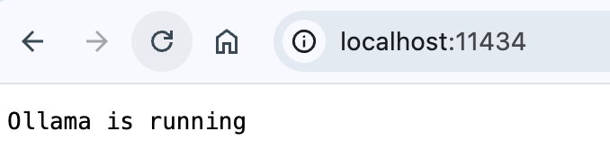
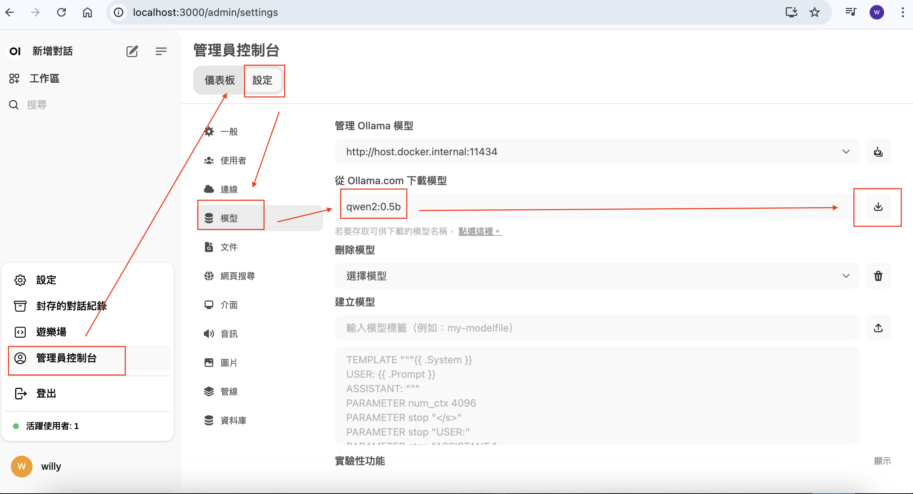

# local ai Setup


```
docker compose up -d
```

check http://localhost:11434



<br>

http://localhost:3000/auth

register user


<br>

download model


or run in ollama container without open webui

```
ollama pull qwen2:0.5b
```